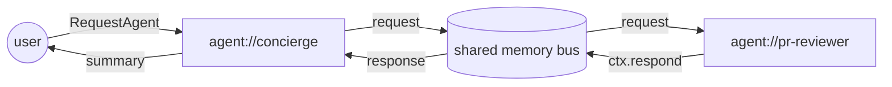

# `fleet-starter`

Two-agent starter: a **concierge** (RPC producer, Haiku 4.5) paired
with a **pr-reviewer** (RPC consumer, Sonnet 4.6), declared in one
`fleet.yaml` and run together in one process. The template is the
canonical reference for [`declaragent fleet`](/reference/fleet) —
every verb in that surface is exercised here.

:::info Since v1.2
Introduced in v1.2. See [Reference → Fleet](/reference/fleet) for the
manifest schema + CLI surface.
:::

## What you'll ship



One `correlationId` threads the chain. `declaragent events list
--correlation <id>` on either agent surfaces every hop.

## Scaffold

```bash
declaragent init --template fleet-starter --out acme-fleet
cd acme-fleet
bun install
```

What you get:

```
acme-fleet/
├── fleet.yaml            # 2 agents, shared env, rolling deploy
├── package.json          # bun workspaces + @declaragent/core pin
├── rpc-peers.yaml        # fleet-level peer table (memory → kafka ready)
├── .env.example          # ANTHROPIC_API_KEY + KAFKA_BROKERS (opt)
└── agents/
    ├── concierge/        # RPC producer
    └── pr-reviewer/      # RPC consumer
```

## Validate + explore

Everything read-only, safe to run in CI:

```bash
declaragent fleet validate             # ✓ fleet validates clean
declaragent fleet list                 # agents + capability counts
declaragent fleet capabilities         # aggregated capability table
declaragent fleet graph                # mermaid RPC edge graph
declaragent fleet peers --verify       # probe every peer transport
```

`fleet validate` surfaces peer-graph issues before you boot the daemon:

- `peer.dangling` — `rpc-peers.yaml` points at an agent id no one
  declares.
- `peer.client-only` — an in-fleet peer has no `capabilities.yaml`;
  callers will fault at request time.
- `capability.duplicate` — the same capability name is offered by more
  than one agent.
- `deploy.target.missing` — an `agents[].deploy.target` references an
  undeclared target.

Non-zero exit on any error-severity finding.

## Run locally — one process

Leave `KAFKA_BROKERS` unset in `.env`. Both agents share an in-memory
RPC bus; no broker setup required.

```bash
declaragent fleet run
```

Output:

```
fleet: fleet-starter
running 2 agents:
  • concierge  capabilities=0 topics=0 (client-only)
  • pr-reviewer  capabilities=1 topics=1
ready. press ctrl-c to stop.
```

Subset selection is `--agent <id>` (repeatable):

```bash
declaragent fleet run --agent pr-reviewer
```

### Watch a request round-trip

Open a second shell:

```bash
declaragent                                         # launches the REPL
> Please review https://github.com/acme/app/pull/42
```

The concierge's `delegate` skill fires `RequestAgent({to: agent://pr-reviewer, capability: review-pr, payload: {prUrl}})`.
The pr-reviewer's `review-pr` skill calls `ctx.respond({...})`. The
whole round-trip completes in-process in under 200ms on a warm cache.

## Run across processes (Kafka)

Swap the `kind: memory` block for `kind: kafka` in both
`rpc-peers.yaml` and `agents/pr-reviewer/capabilities.yaml` — the
commented-out blocks in the template show the exact shape:

```yaml
# rpc-peers.yaml
peers:
  - agent: agent://pr-reviewer
    transports:
      - kind: kafka
        brokers: ["${env:KAFKA_BROKERS}"]
        topics:
          requests: agents.pr-reviewer.requests
```

Set `KAFKA_BROKERS` in `.env` and start the two agents in separate
terminals:

```bash
declaragent fleet run --agent pr-reviewer          # terminal 1
declaragent fleet run --agent concierge            # terminal 2
```

Envelope wire format is byte-identical across memory and Kafka — no
code change.

## Deploy

The template pre-declares a `cloud-run-reviewer` target. Wire your own
Cloud Run credentials and:

```bash
declaragent fleet deploy --target cloud-run-reviewer
```

Rolling strategy (the default) runs agent-by-agent and gates each on a
`/healthz` probe; failure aborts + rolls back everything deployed so
far. History is appended to `.declaragent/fleet-deploys.jsonl`:

```bash
declaragent fleet deploy --rollback                # revert to the previous fleet version
declaragent fleet status --history                 # last 5 deploys
```

### Opt into version-skew detection

Flip `fleet.yaml → rpc.stampFleetVersion: true` so every outbound
`RequestAgent` envelope carries an `x-fleet-version` header. Add
`rpc.minFleetVersion: v1.2.0-cut` to reject pinned-old callers with
`EVERSION_SKEW`. The `fleet deploy` flow stamps
`DECLARAGENT_FLEET_VERSION` on every agent so the comparison works
end-to-end.

## Day-two ops

```bash
declaragent fleet status                 # static snapshot
declaragent fleet status --history       # + last 5 deploys
declaragent fleet graph --format json    # for CI gates that need a structured shape
declaragent fleet peers --verify --json  # dashboard-ready peer health
```

## Cost

| Component | Model | Cost / request |
| --- | --- | --- |
| concierge | Haiku 4.5 (~1k in / 400 out) | ~$0.002 |
| pr-reviewer | Sonnet 4.6 (~8k in / 1.5k out) | ~$0.04 |
| **Per review** | | **~$0.042** |

20 reviews/day on Cloud Run (`minInstances=1`, `cpu=1`, `mem=512Mi`):
**~$66/month**. Bigger monorepos push token spend into the $100–$200
band — watch the receiver's `token.ledger` metric.

## What's next

- Add a third agent: `declaragent fleet add --template pr-review --id
  triage`.
- Turn on tenants: uncomment `tenantsRef:` in `fleet.yaml` and add a
  `tenants.yaml` alongside.
- Promote an existing single-agent repo: `declaragent fleet promote
  ./other-agent --apply`.

See [Reference → Fleet](/reference/fleet) for the full manifest schema
and [`templates/fleet-starter/`](https://github.com/declaragent/declaragent/tree/main/templates/fleet-starter)
for the source.
