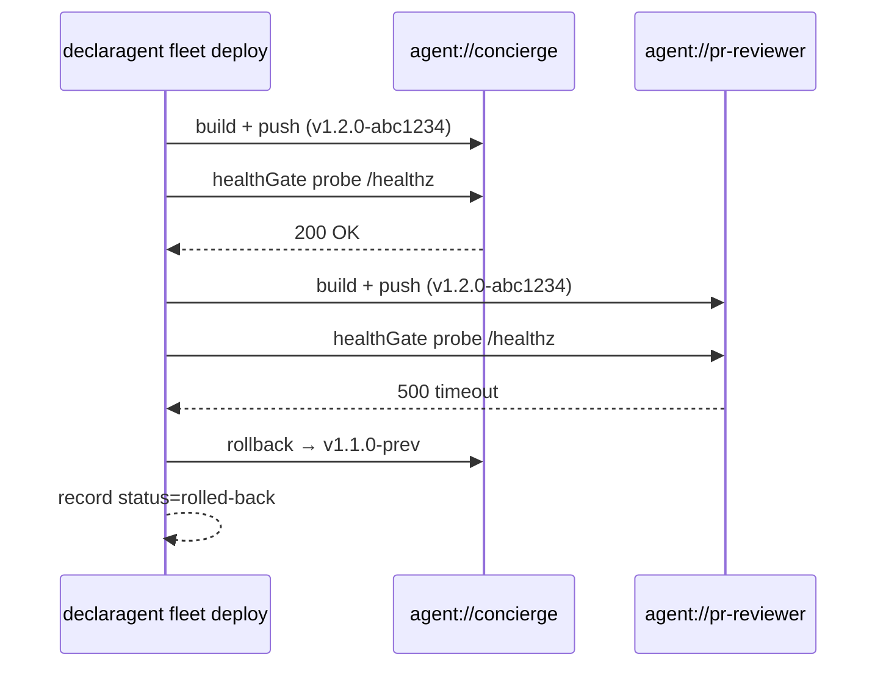

# Fleet

One directory, one `fleet.yaml`, N agents. A fleet is the declarative
monorepo shape for teams that run more than one agent together — shared
tenants, shared peer table, shared secrets, one dev loop, one deploy.

:::info Since v1.2
Introduced in v1.2. Single-agent layouts keep working unchanged;
fleets are opt-in.
:::

## When to use a fleet

Use a fleet when two or more agents:

- call each other over [Agent RPC](/reference/rpc) (concierge →
  pr-reviewer is the canonical pair), or
- share a tenant registry / peer table / Slack channel, or
- roll out together (rolling deploy, one health gate, one rollback
  button).

Everything else — a single agent, a demo, a one-shot script — stays in
the single-agent layout. No fleet, no `fleet.yaml`.

## Layout

```
my-fleet/
├── fleet.yaml                # manifest — what agents + how they relate
├── package.json              # "workspaces": ["agents/*"]
├── bun.lock                  # single lockfile for the whole fleet
├── tenants.yaml              # shared tenant registry (optional)
├── rpc-peers.yaml            # cross-agent peer table (aggregated)
├── secrets.yaml              # shared secret providers + scopes
├── channels.yaml             # shared channel registry (optional)
├── .env                      # shared env
├── .env.example
├── agents/
│   ├── concierge/
│   │   ├── agent.yaml
│   │   └── skills/
│   └── pr-reviewer/
│       ├── agent.yaml
│       ├── capabilities.yaml
│       └── skills/
└── deploy/
    └── gcp-cloud-run.yaml    # fleet-level deploy target config
```

**Invariant.** Remove `fleet.yaml` + the shared config files and each
`agents/<name>/` runs as a standalone single-agent repo. Promotion +
demotion are exact inverses of this property.

## Manifest schema

```yaml
# fleet.yaml
version: 1
name: acme-fleet
description: "Concierge + specialist agents for the Acme eng org."

runtime:
  declaragent: "^1.2.0"
  bun: ">=1.1"

agents:
  - id: concierge
    path: ./agents/concierge
    env: shared
    deploy:
      target: cloud-run-concierge
      minInstances: 1
      maxInstances: 10
  - id: pr-reviewer
    path: ./agents/pr-reviewer
    env: shared
    deploy:
      target: cloud-run-reviewer

environments:
  shared:
    tenantsRef: ./tenants.yaml
    peersRef: ./rpc-peers.yaml
    secretsRef: ./secrets.yaml
    channelsRef: ./channels.yaml
    envFiles:
      - ./.env
    overrides:
      pr-reviewer:
        secretScopes: ["vault:kv/acme/github-tokens"]
  staging:
    inherit: shared
    tenantsRef: ./tenants.staging.yaml

rpc:
  stampFleetVersion: false
  # minFleetVersion: v1.2.0-cut

deploy:
  strategy: rolling            # rolling | all-or-nothing | per-agent
  rollbackOnFailure: true
  healthGate:
    timeoutMs: 120000
    probe: /healthz
  targets:
    cloud-run-concierge:
      kind: gcp-cloud-run
      region: us-central1
      serviceAccount: concierge@acme.iam.gserviceaccount.com
    cloud-run-reviewer:
      kind: gcp-cloud-run
      region: us-central1
      serviceAccount: reviewer@acme.iam.gserviceaccount.com
```

### Top-level fields

| Field | Type | Required | Description |
| --- | --- | --- | --- |
| `version` | `1` | yes | Schema version. Frozen at v1 for v1.2. |
| `name` | string | yes | Fleet name. Also the default root `package.json` name. |
| `description` | string | no | Free-form. |
| `runtime` | object | no | Pins `declaragent` + `bun` versions. |
| `agents[]` | array | yes | Ordered list of fleet members. May be empty for a fresh scaffold. |
| `environments{}` | map | no | Per-environment shared config. Default is an implicit `default` env. |
| `rpc` | object | no | Opt-in RPC knobs (see [Version skew](#version-skew)). |
| `deploy` | object | no | Strategy + targets for `declaragent fleet deploy`. |

Strict mode is enabled on every object — unknown keys fail load, so a
typo'd field name surfaces on CI rather than silently no-opping.

### Agent entry

```yaml
agents:
  - id: pr-reviewer
    path: ./agents/pr-reviewer
    env: shared
    deploy:
      target: cloud-run-reviewer
      minInstances: 0
      maxInstances: 4
    sessionDb: ./agents/pr-reviewer/session.db   # per-agent override
    auditDb: ./agents/pr-reviewer/audit.db       # per-agent override
```

- `id` must match `agents/<id>/agent.yaml.name` exactly. Mismatch is a
  load-time error — one source of truth across envelopes, audit
  records, and metrics (§14.4).
- `path` is relative to the fleet root.
- `env` references a key in `environments{}`. Omit for the implicit
  `default` env.
- `deploy.target` references a key in `deploy.targets{}`; load-time
  validation rejects dangling references.
- `sessionDb` / `auditDb` are per-agent opt-outs from the fleet-level
  default (§14.2). Noisy-neighbor tenants opt into per-agent session
  DBs; the audit sink stays shared for GDPR compliance.

### Environments

```yaml
environments:
  shared:
    peersRef: ./rpc-peers.yaml
    secretsRef: ./secrets.yaml
    envFiles: [./.env]
    overrides:
      pr-reviewer:
        secretScopes: ["vault:kv/acme/github-tokens"]
  staging:
    inherit: shared
    tenantsRef: ./tenants.staging.yaml
```

- `inherit:` flattens another env's fields in first; child values win.
  Cycles are rejected at load time with a chain dump.
- `overrides{<agentId>}:` layers on top of the inherited overrides map —
  per-agent-id granularity; replacing an override wholesale replaces
  the whole entry.
- The CLI exports every env's `envFiles` via `declaragent fleet run` +
  `fleet deploy` so agents boot with the right env vars in place.

### Deploy strategies

| Strategy | Shape | Use when |
| --- | --- | --- |
| `rolling` (default) | Sequential per-agent deploy. `healthGate.probe` GETs each agent after push; failure aborts + rolls back everything deployed so far. | You value blast-radius containment over latency. |
| `all-or-nothing` | Parallel build + push. Failure of any agent rolls back all. | You have a small fleet + can't tolerate mixed versions. |
| `per-agent` | Fire-and-forget; no coordination. | Back-compat with teams that still `gcloud run deploy` per-agent. |

Rolling deploy example timeline:



## Config precedence

Resolved top-down, first match wins:

1. **Per-agent inline** — `agent.yaml` fields.
2. **Fleet-environment override** — `fleet.yaml → environments.<env>.overrides`.
3. **Fleet-root shared config** — `tenants.yaml`, `rpc-peers.yaml`, etc.
4. **Built-in defaults**.

## CLI surface

Every fleet-aware verb is under `declaragent fleet <subcommand>`:

| Verb | Purpose |
| --- | --- |
| `fleet new <name>` | Scaffold a new fleet at `<cwd>/<name>/`. Alias: `declaragent init --fleet <name>`. |
| `fleet add --template <t> [--id <id>]` | Add an agent from a starter template (`rpc-client`, `rpc-server`, etc.). |
| `fleet add --path <dir> [--id <id>]` | Copy an external single-agent directory into `agents/<id>/`. |
| `fleet promote <path> [--apply] [--id <id>]` | Convert a single-agent directory into a fleet-of-one. `--dry-run` is the default — add `--apply` to mutate. |
| `fleet demote [<id>]` | Inverse of promote. Refuses when the fleet has more than one agent. |
| `fleet run [--agent <id>...]` | Single-process dev loop. Boots every agent over a shared in-memory RPC bus. |
| `fleet deploy [--target <name>] [--agent <id>...] [--strategy <s>]` | Coordinated deploy. `--dry-run` / `--rollback` / `--target-config <path>`. |
| `fleet list [--json]` | Agents + env + capability counts. |
| `fleet validate [--json]` | Schema + peer-graph dry-run. Non-zero exit on any error-severity finding. |
| `fleet capabilities [--json]` | Aggregated capability table across every agent. |
| `fleet graph [--format mermaid\|dot\|json]` | Emit the inter-agent RPC edge graph. |
| `fleet peers [--verify] [--json]` | Print + optionally probe the peer table. |
| `fleet status [--history] [--limit <n>] [--json]` | Snapshot: per-agent config, peer reachability, recent deploys. |

Outside a fleet directory, every `fleet` verb errors with a hint at
`declaragent init --fleet <name>`.

## Promote + demote

A single-agent repo becomes a fleet-of-one via `declaragent fleet
promote <path>`. Dry-run is the default — inspect the plan, then
`--apply`:

```bash
declaragent fleet promote ./my-agent            # print the mv/rewrite plan
declaragent fleet promote ./my-agent --apply    # mutate
declaragent fleet demote                        # exact inverse — fleet-of-one → single
```

What the flow does:

- Moves every agent-specific file under `agents/<id>/`: `agent.yaml`,
  `capabilities.yaml`, `event-sources.yaml`, `skills/`, etc.
- Keeps fleet-level artifacts at the root: `.env`, `.env.example`,
  `package.json` (rewritten to add `"workspaces": ["agents/*"]`).
- Writes a new `fleet.yaml` with one agent entry.
- Drops a `PROMOTED.md` at the root explaining the inverse command.

### When NOT to promote

- Agents that share code via relative imports — turn into a proper
  monorepo with a shared `packages/` dir first.
- Agents already published to npm under their own name with external
  dependents — fleet membership changes the import path.

### Risks it flags

- CI workflow paths in `.github/workflows/*.yml` that hardcode paths
  like `packages/core/` break post-move. Promote warns but doesn't
  rewrite — that's the user's call.
- Dockerfiles / Cloud Run YAMLs that reference `agent.yaml` at the
  repo root need updating. Promote lists every match.
- Already-published npm packages: the new `agents/<id>/` layout may
  not match the `files:` array in `package.json`.

Refuses when the working tree is dirty unless `--force` is set — the
apply is git-stage-then-mv so `git reset` + `git checkout` reverts.

## Version skew

Opt-in per-fleet (§14.8). When `fleet.yaml → rpc.stampFleetVersion` is
`true`, every outbound `RequestAgent` envelope carries an
`x-fleet-version: v1.2.0-abc1234` header. Receivers compare the
caller's version against their own `DECLARAGENT_FLEET_VERSION` + the
optional `minFleetVersion` gate:

| Caller vs receiver | Action |
| --- | --- |
| Same version | OK |
| Older caller, ≥ `minFleetVersion` | Accept (rolling-deploy transient). |
| Newer caller | Accept + log `fleet.version.skew` + increment metric. |
| Caller &lt; `minFleetVersion` | Reject with RPC error code `EVERSION_SKEW`. |

`declaragent fleet deploy` stamps `DECLARAGENT_FLEET_VERSION` on every
deployed agent; the `FleetDeployTarget.deploy()` adapter hands the var
to Cloud Run / K8s env injection.

## Design decisions

Every lean in §14 of `docs/FLEET_PLAN.md` is a concrete v1.2 commit:

| Decision | Answer |
| --- | --- |
| Agent enumeration | Explicit in `fleet.yaml → agents[]`. No auto-discovery in v1.2. |
| Session + audit storage | Shared at fleet root; per-agent opt-out. |
| Channel ownership | Explicit `owner:` per channel, per environment. |
| Agent id invariant | `fleet.yaml → agents[].id == agent.yaml.name`. Strict. |
| Workspace manager | Bun only in v1.2. `fleet install` wraps `bun install`. |
| Versioning | Changesets at the fleet root; per-agent semver via `mode: independent`. |
| Deploy targets | Fleet-level only. Ad-hoc via `--target-config <path>`. |
| `x-fleet-version` | Opt-in via `rpc.stampFleetVersion`. |
| Graph format | `mermaid` default; `--format dot\|json` available. |
| `fleet demote` scope | Fleet-of-one only; refuse for `N > 1`. |

## See also

- [Cookbook → `fleet-starter`](/cookbook/fleet-starter) — walkthrough of
  the template that pairs concierge + pr-reviewer.
- [Reference → Agent RPC](/reference/rpc) — envelope format + transport
  contracts that `fleet run` + `fleet deploy` wire together.
- [`docs/FLEET_PLAN.md`](https://github.com/declaragent/declaragent/blob/main/docs/FLEET_PLAN.md)
  — the design-frozen plan this page summarizes.
