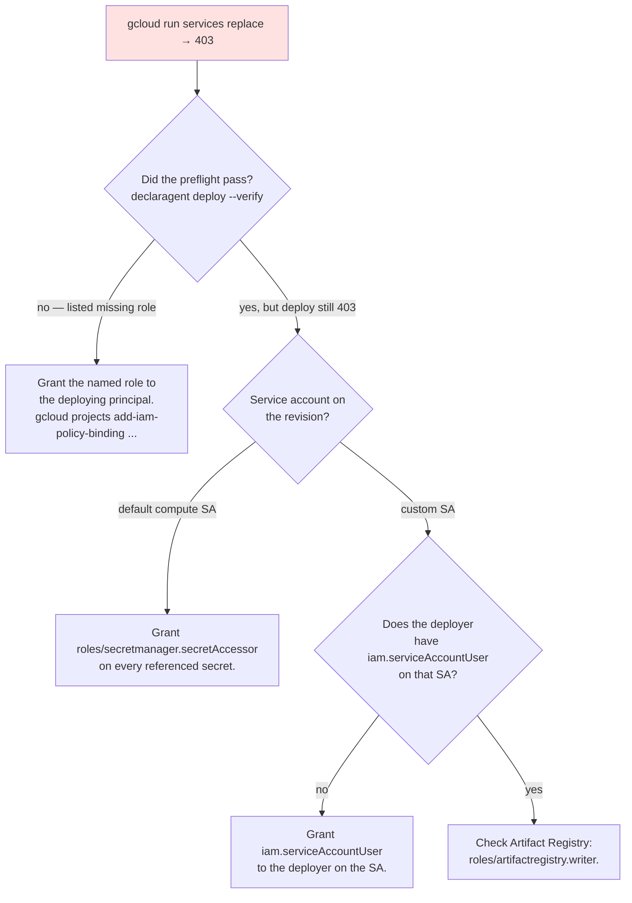

# My `declaragent deploy` got 403

The single most common Cloud Run failure. `gcloud run services replace` returns HTTP 403 + a cryptic `Permission 'run.services.create' denied`.

## Flowchart



## The three IAM roles that matter

The [§9.2 preflight](https://github.com/declaragent/declaragent/blob/main/docs/PHASE_7_PLAN.md) checks these:

| Role | Why it's needed |
| --- | --- |
| `roles/run.admin` | Create + update the Cloud Run service. |
| `roles/iam.serviceAccountUser` | Attach a service account to a Cloud Run revision. |
| `roles/secretmanager.secretAccessor` | Bind `${secret:...}` refs into env vars. |

If your deploying principal is missing any of these, `declaragent deploy --verify` will tell you which before `gcloud` has a chance to 403 you.

## Quick fixes

```bash
# The deploying principal — usually your gcloud user.
PRINCIPAL="user:you@example.com"
PROJECT="my-project"

gcloud projects add-iam-policy-binding "$PROJECT" \
  --member="$PRINCIPAL" --role="roles/run.admin"
gcloud projects add-iam-policy-binding "$PROJECT" \
  --member="$PRINCIPAL" --role="roles/iam.serviceAccountUser"
gcloud projects add-iam-policy-binding "$PROJECT" \
  --member="$PRINCIPAL" --role="roles/secretmanager.secretAccessor"
```

## Still stuck

- Run `declaragent deploy gcp-cloud-run --verify` and paste the full output into a GitHub issue — the preflight message is the most diagnostic piece.
- Confirm the `Dockerfile` + `service.yaml` generators emitted the expected secret bindings by inspecting `.declaragent/deploy/service.yaml`.

## Related

- [Cookbook → Deploy to Cloud Run](/cookbook/deploy-cloud-run).
